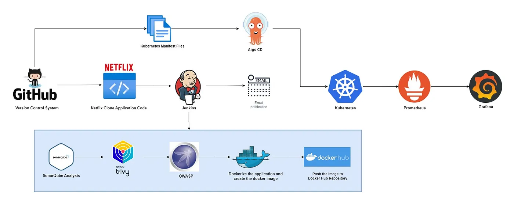

# netflop-infra
Setup a Netflix Clone deployment to Kubernetes

# Setup ec2

1. Setup ec2 with Jenkins, SonarQube, Trivy, ArgoCD
2. Run ec2 terraform script

## Jenkins Setup

1. Access Jenkins at http://ec2-ip:8080
2. Go Manage Jenkins -> Plugins
3. Install following plugins
  - Eclipse Temurin Installer
  - SonarQube Scanner
  - NodeJs Plugin
  - OWASP Dependency-Check
  - Docker
  - Docker Commons
  - Docker Pipeline
  - Docker API
  - docker-build-step

### Configure Dependency-check and Docker Tool
1. Add Dockerhub access in Credentials.
2. Go to Dashboard -> Manage Jenkins -> Tools. Setup Dependency-Check Installation configuration. eg Name: DP-Check
3. Setup Docker configuration. eg Name: Docker

## Setup SonarQube

1. Access SonarQube at http://ec2-ip:9000
2. Go Administration -> Configuration -> Webhooks. Create Webhook with URL: http://ec2_ip:8080/sonarqube-webhook/
3. Go Administration -> Security -> User -> Token. Create sonar-token
4. Go to Manage Jenkins -> System. Setup SonarQube Servers configuration.
5. Go to Manage Jenkins -> Tools. Setup SonarQube Scanner Installations configuration
5. At SonarQube. Create New Project -> Manually

## Prometheus
1. Check the validity of the configuration file:
  `promtool check config /etc/prometheus/prometheus.yml`
2. Reload the Prometheus configuration without restarting:
  `curl -X POST http://localhost:9090/-/reload`
3. Access Prometheus target at http://<prometheus-ip>:9090/targets

## Grafana
1. Import Data Source -> Prometheus (http://localhost:9090)
2. Import Dashboard
  - Node exporter dashboard - 1860 
  - Jenkins dashboard - 9964 (require install Prometheus plugin in Jenkins)